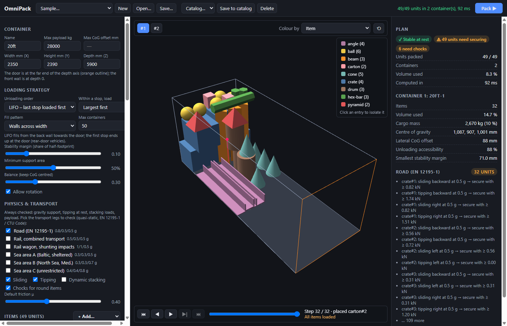
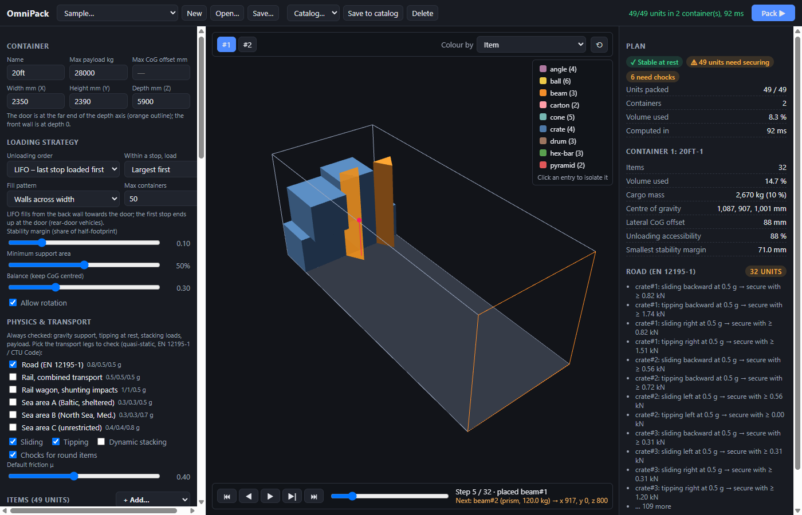
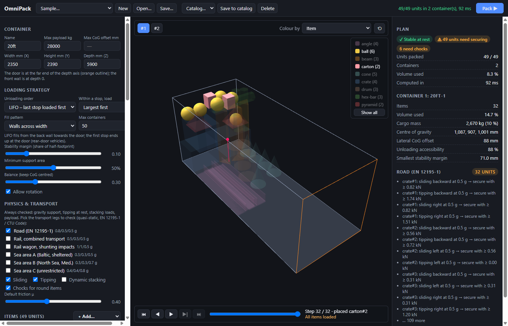
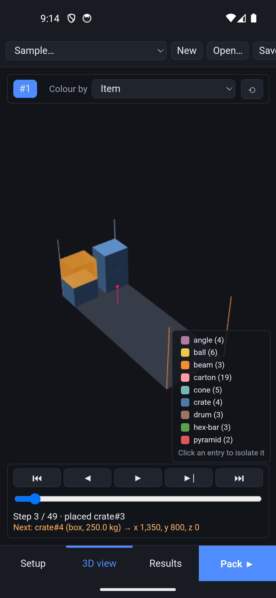
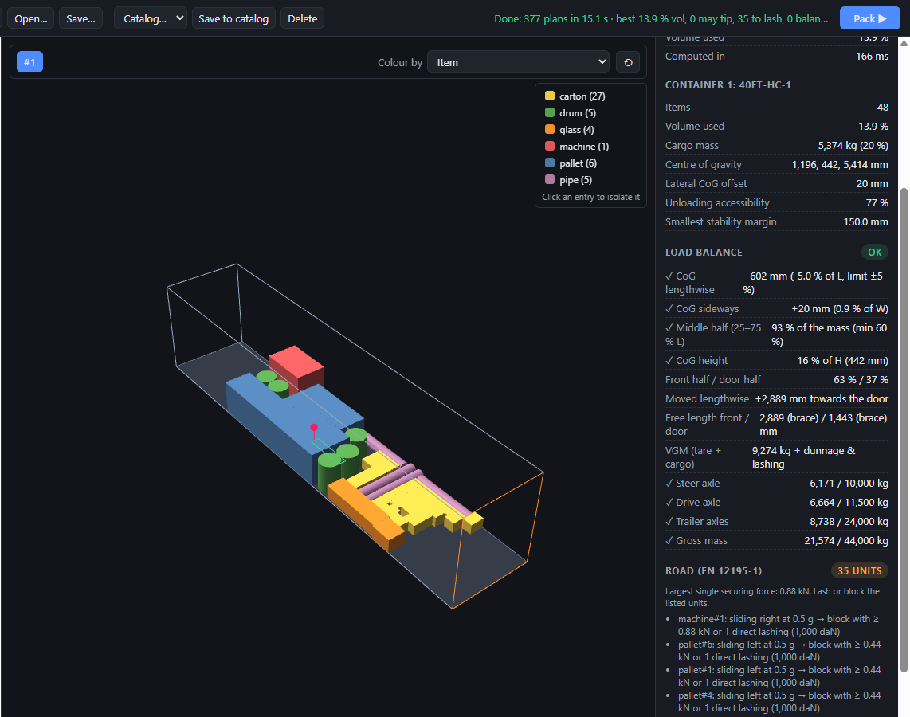
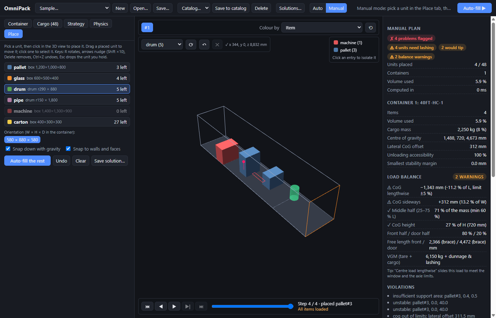

# OmniPack

**OmniPack is a 3D loading planner for containers, trucks and rail wagons.** You describe
the container and the cargo: boxes, drums, balls, cones, pyramids, prisms and L-profiles,
with their mass, stacking limits, fragility, "this side up" and delivery stops. OmniPack
works out where every item goes. It shows the result in 3D, step by step in loading
order, and checks it against real physics:

- **Stable at rest.** Nothing floats or overlaps, every centre of gravity sits over its
  support area, round items are wedged or chocked, and weight is followed down every
  stack so no item carries more than its limit. Payload, axle loads and the cargo's
  centre-of-gravity window are checked too.
- **Safe in transport.** Sliding and tipping under braking, cornering and sea motion are
  checked for road (EN 12195-1), rail (combined transport and shunting impacts) and sea
  areas A/B/C (CTU Code), or for a sea leg derived from the ship's roll and pitch. The
  result says which items need lashing or blocking, with how much force and how many
  direct lashings.
- **Balanced.** The load is checked against the CTU Code (centre of gravity within ±5% of
  the length and width, enough mass in the middle half, centre of gravity low). OmniPack
  also checks the floor pressure against the floor rating, reports the VGM (tare +
  cargo), and checks the axle loads of a tractor and semi-trailer against the EU limits.
  Partial loads can be centred lengthwise automatically.

A second, independent validator re-checks every plan before it is shown.



| Loading sequence, one step at a time | Isolate item groups from the legend | Android |
|---|---|---|
|  |  |  |





## Download

Get the latest build from the [Releases](../../releases) page:

| Platform | File | Notes |
|---|---|---|
| Windows 10/11 (x64) | `OmniPack_<version>_x64_en-US.msi` or `…_x64-setup.exe` | Uses the WebView2 runtime (built into Windows 11). |
| Android 7.0+ | `OmniPack_<version>_android-universal.apk` | Sideload: allow "install unknown apps" for your browser or file manager. |
| API server | `omnipack-server_<version>_windows-x64.exe`, `…_linux-x64` | The integration API without the app, or `docker build` from the repository. See [docs/api.md](docs/api.md). |

The installers are not code-signed yet, so Windows SmartScreen may ask you to confirm
("More info → Run anyway"). The APK is signed with a test key; see
[docs/building.md](docs/building.md#android-signing).

## Features

- **Shapes:** box, cylinder/drum, sphere, cone, pyramid, n-sided prism, L-profile (angle),
  each with its allowed resting orientations. Volumes and centres of gravity come from
  the true geometry.
- **Loading strategies:**
  - Unloading order: **LIFO** (rear door, last stop loaded first) or **FIFO** (side
    loading, first stop loaded first).
  - Within a stop: largest, heaviest, largest base or tallest first, or as listed.
  - Fill patterns: walls across the width, floor layers, walls along the length, rows
    along the length, from a corner.
  - A balance slider keeps the centre of gravity near the centreline.
  - **★ Best: search all patterns & orders:** a time-boxed search (every pattern ×
    priority, then a genetic search over loading orders and orientations, then local
    search). Every candidate is fully physics-checked, and you choose between up to
    three different plans.
- **Containers and pallets:** presets for 20 ft, 40 ft and 40 ft high cube containers
  (inside size, door, tare, payload, floor rating) and a 13.6 m semi-trailer, plus EPAL 1
  and EPAL 2 pallet items.
- **Constraints:** fragile, max load on top, floor only, this side up, delivery stop,
  back/door zone, friction, off-centre centre of gravity (with a 3D preview of each item),
  container payload, the door opening, axle limits, centre-of-gravity limits.
- **Physics you choose:** tick the transport legs to check, and switch sliding, tipping,
  dynamic stacking, chocks for round items and the secured load end on or off. Set the
  friction (EN 12195-1 presets, anti-slip mats), the largest gap that dunnage fills, and
  the lashing (capacity, lashing points, angles). Build a sea case from the ship's beam,
  GM, roll and pitch at the container's stowage place.
- **Load balance:**
  - CTU Code warnings for the centre of gravity, the middle-half share and the
    centre-of-gravity height;
  - floor pressure against the floor rating;
  - VGM;
  - steer, drive and trailer axle loads and the gross mass of a tractor + semi-trailer;
  - optional lengthwise centring of partial loads.
- **Results:**
  - Fill %, mass, centre of gravity, axle loads and unloading accessibility.
  - Violations, with the reason for any unit that did not fit.
  - Per unit: secured, held once gaps are filled, chocks, or needs lashing, with the
    force and the number of direct lashings needed per transport case and the list of
    gaps to fill.
  - A load balance section with ✓ / ⚠ per check.
- **3D viewer:**
  - Colour by item, stop, load against limit, stability margin, securing needed, an
    impact heatmap of transport forces, or floor pressure.
  - The allowed centre-of-gravity window and the quarter lines of the length are drawn
    on the floor.
  - Click legend entries to isolate groups.
  - Step through loading with ⏮ ◀ ▶ ▶| ⏭ (or ← → Home End Space), with a preview of
    the next item and where it goes.
- **Manual placement:**
  - A Manual mode where you place units yourself: click to drop a unit under gravity,
    drag it to move it, and nudge or rotate it with the keys.
  - A live green/red ghost shows whether the position passes the checks. Nothing is
    refused: problems are flagged.
  - **Auto-fill the rest** packs the remaining units around yours.
- **Learned placement:**
  - Save good plans (yours or automatic) and mark them for training.
  - OmniPack learns your way of loading in seconds, on the device. It adds a
    **Learned** fill pattern, which ★ Best also tries.
  - The decisions can be exported as training data for other models.
- **Setup panel:** tabs (Container, Cargo, Strategy, Physics), foldable sections with
  summaries, a compact cargo list, and a resizable width.
- **Integration API for ERP systems such as SAP:**
  - REST with an OpenAPI description.
  - A simple ERP format (SAP field names and unit codes) or the full JSON: send the
    container and the cargo, get every placement back as JSON or a CSV load list.
  - Background jobs with callbacks, file drop folders, and validation of plans made
    elsewhere.
  - It runs as a standalone `omnipack-server` (Windows, Linux, Docker) or inside the
    Windows app ("Local API").
- **Files:** save and open setups (JSON), a catalog of saved setups, saved solutions,
  and export of the plan as JSON or a CSV load list.
- **Runs offline** on Windows and Android, with the engine built into the app.

## Documentation

| Document | For |
|---|---|
| [User guide](docs/user-guide.md) | Using the app: setup, strategies, physics options, reading the results |
| [Physics model](docs/physics-model.md) | Exactly what is checked and how, at rest and in transport |
| [Learned placement](docs/learning.md) | How OmniPack learns placement from your saved plans, and the training-data format |
| [API](docs/api.md) | Connecting other systems (SAP and others): REST, jobs, drop folders, server setup |
| [Research notes](docs/research/packing-stability.md) | Literature behind the placer, securing model and search, with measured effects |
| [Conventions](docs/conventions.md) | Axes, units, shapes, orientations, fill patterns, JSON format |
| [Building](docs/building.md) | Building from source, Windows installers, Android APK, signing |
| [CHANGELOG](CHANGELOG.md) | Release history |

## Project layout

```
crates/omnipack-geom   shapes, orientations, exact collision / contact / drop queries (parry3d)
crates/omnipack-core   data model, placer, static + transport physics, validator, generators
crates/omnipack-opt    search: pattern sweep, BRKGA over orders and orientations, local search
crates/omnipack-cli    `omnipack` command-line tool (pack, optimize, train, generate samples, benchmark)
crates/omnipack-api    the integration API (REST, ERP format, jobs, drop folders), used by the server and the app
crates/omnipack-server `omnipack-server`: the API as a standalone service (Dockerfile in the root)
app/                   Tauri 2 app: src-tauri (Rust shell) + web UI (TypeScript, Vite, Babylon.js)
docs/                  documentation and screenshots
release/               built installers and APK (published as GitHub release assets)
```

## Quick start from source

```
cargo test --workspace                                      # engine tests, including property tests
cargo run --release -p omnipack-cli -- gen mixed 1 -o out/mixed.json
cargo run --release -p omnipack-cli -- pack out/mixed.json -o out/plan.json
cd app && npm install && npx tauri dev                      # the desktop app with hot reload
```

See [docs/building.md](docs/building.md) for the installers and the Android APK.

## Status and roadmap

The Rust/Tauri app started with version 0.2, a complete rewrite of the earlier Python
prototype. The prototype is kept in the `v0-legacy` tag. Version 0.5 adds the load
balance, the vehicle axle loads, the floor and door checks, the lashing count and the
ship-motion sea cases. Version 0.6 adds manual placement, saved solutions and a learned
placement score. Version 0.7 adds the integration API (server and Local API) and better
phone parity. Next on the list:

- **Rigid-body simulation** (Rapier3D) with replay.
- **More search:** NSGA-II Pareto fronts and block building on top of the current
  BRKGA search.
- **Arbitrary meshes:** imported items with any shape.
- **A neural ranking model** (ONNX), trained on the exported decisions, to go beyond
  the learned linear score.

## License

Licensed under the [Apache License, Version 2.0](LICENSE). See [NOTICE](NOTICE) for
third-party components.
