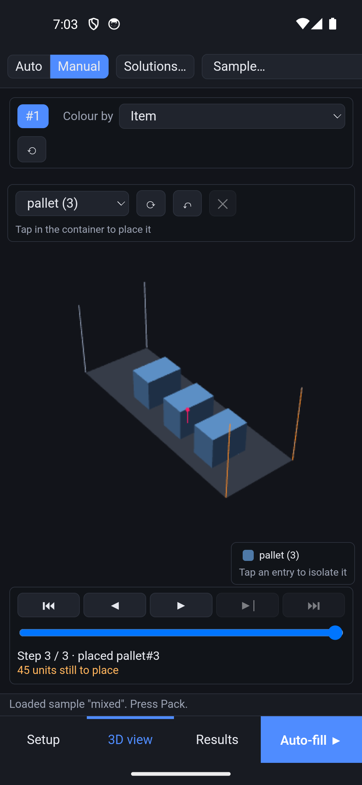
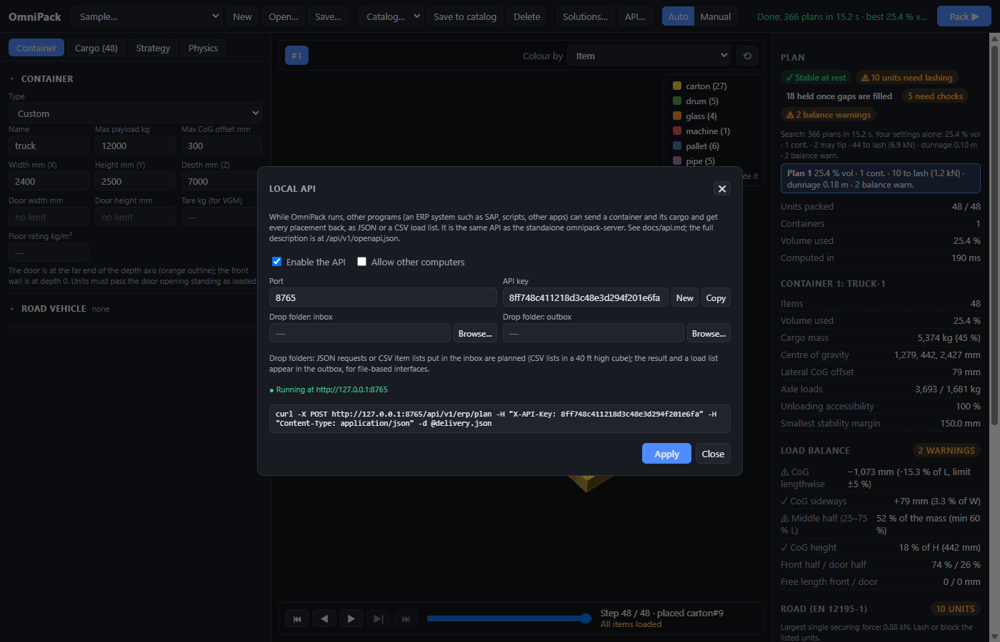

# User guide

This guide walks through the OmniPack app on Windows and Android. Both use the same
screens; on a phone they are split into **Setup**, **3D view** and **Results** tabs, with
a **Pack** button at the bottom.

The app has two modes, switched in the toolbar:
- **Auto:** OmniPack places everything.
- **Manual:** you place units yourself, and OmniPack can fill in the rest (see
  [Manual placement](#8-manual-placement)).

### On a phone or tablet

The phone app has the same engine and features, with these differences:
- One panel at a time: **Setup**, **3D view** or **Results**, chosen at the bottom.
  Messages show on a line just above those tabs.
- The toolbar scrolls sideways. **Auto | Manual** and **Solutions…** come first, and
  Sample, New, Open, Save and the catalog follow.
- In manual mode, tap to place. There is no hover preview, so the green or red ghost only
  shows while you drag. To move a unit, choose **Select / move** in the bar over the 3D
  view, then drag it. The bar's ⟳, ↶ and ✕ buttons replace the keyboard shortcuts, and
  the exact X / Y / Z fields are under **Results**.
- There is no panel resizing and no local API (that is a desktop feature).

### The setup panel

The setup panel on the left has four tabs: **Container**, **Cargo**, **Strategy** and
**Physics**. In manual mode there is a fifth, **Place**.
- Within a tab, the settings are grouped in sections that fold away.
- A folded section shows a one-line summary, for example "40 ft high cube · 2352 ×
  2698 × 12 032 mm · door 2340 × 2585".
- The app remembers the open tab, which sections are open, and the panel width.
- To make the panel wider or narrower, drag its right edge (desktop).

## 1. Describe the container

In the **Container** tab, pick a **Type** or enter the inside width (X), height (Y) and depth (Z)
in millimetres yourself. The **door is at the far end of the depth axis** and is drawn
in orange. Depth 0 is the front wall, where braking pushes the cargo.

| Type | Inside W × H × D (mm) | Door (mm) | Tare (kg) | Payload (kg) |
|---|---|---|---|---|
| 20 ft standard (20' DV) | 2352 × 2393 × 5898 | 2340 × 2280 | 2230 | 28 250 |
| 40 ft standard (40' DV) | 2352 × 2393 × 12 032 | 2340 × 2280 | 3750 | 26 730 |
| 40 ft high cube (40' HC) | 2352 × 2698 × 12 032 | 2340 × 2585 | 3900 | 26 580 |
| Semi-trailer 13.6 m | 2480 × 2700 × 13 600 | side loading | — | 24 000 |

These are typical values for a 30 480 kg maximum gross mass; check the CSC plate of the
actual container. The ISO containers also get a floor rating of 2500 kg/m².

Optional limits:
- **Max payload** (kg).
- **Max CoG offset**: how far the cargo's centre of gravity may move off the
  centreline, in mm. This is a hard limit; the CTU Code balance checks below are
  warnings.
- **Door width / height**: every unit must pass the door opening as it is loaded.
  A unit that is too tall standing up is laid down if it may be rotated; otherwise
  it is left out as "door too small".
- **Tare** (kg): gives the **VGM** (verified gross mass = tare + cargo, SOLAS) and is
  part of the vehicle axle loads.
- **Floor rating** (kg/m²): units pressing harder on the floor are flagged to have
  their load spread with beams.

Leave a field empty for "no limit".

**Road vehicle** (its own section): pick a tractor + 3-axle container chassis to see the steer axle,
drive axle, trailer axles and gross mass against the EU limits (10 t, 11.5 t, 24 t,
44 t). **Vehicle geometry and limits** lets you enter your own vehicle: distances
along the vehicle in mm, rearwards positive, measured from the kingpin or the steer
axle.

## 2. Add the cargo

The **Cargo** tab lists one row per item type: colour, name, shape and size, quantity and
mass per unit.
- Click a row to open its full card, with every field and a 3D preview. Click it again
  to close it.
- **⧉** duplicates an item and **✕** removes it.
- With more than six items, a filter box finds them by name.

Use **+ Add item…** to add an item type, choosing its shape:

| Shape | Size fields | Typical cargo |
|---|---|---|
| Box | W × H × D | cartons, crates, pallets |
| Cylinder / drum | radius, length | drums, rolls, pipes |
| Sphere | radius | balls, tanks |
| Cone | base radius, height | traffic cones, hoppers |
| Pyramid | base W × D, height | packaged pyramids, hoods |
| Prism | sides (3 = triangle, 6 = hexagon…), radius, length | beams, bars, extrusions |
| L-profile | leg A, leg B, thickness, length | steel angles |

**+ Add item…** also offers loaded pallets: **Euro pallet EPAL 1** (1200 × 800) and
**Industrial pallet EPAL 2** (1200 × 1000). Both start 1 m high, 500 kg, this side up,
with friction 0.45 (wood on plywood); set their real height and mass. In a container
2352 mm wide, two EPAL 1 do not fit side by side on their long sides (2400 mm).
Rotation lets OmniPack mix the orientations across the width (1200 + 800, the
pinwheel pattern). EPAL 2 fit two across on their 1000 mm sides.

Each item card shows a **3D preview**: drag to rotate it. It shows the bounding box,
the X/Y/Z axes and the centre of mass.

For each item type you can set:
- **Mass** (kg per unit) and **Quantity**.
- **Max load on top** (kg): everything stacked above counts, not just the item directly
  on top. **Fragile** means nothing may go on top.
- **Stop:** the delivery stop, where 1 is unloaded first. Leave 0 for cargo that stays
  aboard.
- **Zone:** anywhere, near the back wall, or near the door.
- **Friction μ:** friction against whatever the item stands on. Leave it empty to use
  the default.
- **This side up / Upright only:** keeps the item's height axis vertical.
- **Floor only:** the item must stand on the container floor.
- **Centre of mass:** X / Y / Z in mm from the bottom-left-back corner of the
  unrotated item. Leave the fields empty for the geometric centre, or use ↺ to go back
  to it.

Samples (the **Sample…** menu) show complete setups: a mixed truck load, all shapes in
a 20 ft container, and benchmark sets.

## 3. Choose the loading strategy

These settings are in the **Strategy** tab.

- **Unloading order:**
  - **LIFO:** for vehicles unloaded through a rear door. The last stop is loaded first,
    deep inside, and the first stop ends up at the door.
  - **FIFO:** for side-loading or drive-through. The first stop is loaded first and
    filling starts at the door.
- **Within a stop, load:** largest, heaviest, largest base or tallest first, or as
  listed.
- **Fill pattern:** the order in which space is used. Choose walls across the width, full
  floor layers, walls along the length, rows along the length, or growing from a corner.
- **Learned (from your saved plans):** appears once you have trained a model (see
  [Saved solutions and learned placement](#9-saved-solutions-and-learned-placement)).
  It places units the way your marked plans do.
- **★ Best: search all patterns & orders:** instead of one pattern, OmniPack searches.
  It tries every fill pattern and load priority, then evolves loading orders and
  orientations (a genetic search followed by local search). Every candidate gets the full
  physics check, and stops, zones and floor-only rules are always kept.
  - **Search time** (5–120 s): the search keeps the best plans found in that time.
    **Pack** turns into **Stop ■** while it runs; stopping keeps what was found so far.
  - **Prefer:** slide towards *max. density* to fill the most volume, or towards
    *least securing* to favour plans that need less lashing and dunnage.
  - You get up to three clearly different plans to choose from in **Results**, next to
    what your own settings give.
- **Stability margin:** how far each centre of gravity must stay inside its support area.
  0 means "just doesn't tip"; higher values are safer.
- **Minimum support area:** the share of a flat bottom that must rest on something.
- **Balance:** how strongly to keep the load centred left and right.
- **Allow rotation:** lets items turn into any of their resting orientations.
- **CTU Code balance checks:** warns when the load is badly distributed (see
  [Load balance](#load-balance) below). **Balance limits** sets the thresholds:
  - the centre-of-gravity offset (±5% of the length and width);
  - the minimum mass in the middle half of the length (60%);
  - the maximum centre-of-gravity height (50%).
- **Centre load lengthwise:** after packing, slides a partial load along the length,
  by the least amount that meets the centre-of-gravity window and the axle limits.
  The gaps left at the front wall and the door must then be braced with timber or
  airbags. Off by default.

## 4. Choose the physics

Gravity support, tipping at rest, stacking limits and payload are always checked. The
**Physics** tab has these sections:

- **Transport legs:** tick every leg of the journey, for example Road, then Rail
  (shunting), then Sea area B. Each preset lists its accelerations (forward / backward /
  sideways, in g).
- **Sliding:** friction must hold the item unless a wall or a chain of touching items
  blocks it.
- **Tipping:** the item and everything on it must not tip, unless it is blocked higher up
  than its centre of gravity.
- **Dynamic stacking:** stack limits are checked with the vertical acceleration added,
  which matters at sea.
- **Chocks for round items:** lying drums and balls are held with wedges. Switch this off
  to require them to be wedged in by walls or neighbours instead.
- **Load end secured:** a locking bar, gate or dunnage closes the open end of the load.
- **Anti-slip mats:** rubber mats under every item and between layers (μ ≥ 0.6). They
  hold 0.5 g sideways on the road, but not 0.8 g braking.
- **Cargo on floor:** typical friction values from EN 12195-1 (sawn-wood pallet on
  plywood 0.45, plastic pallet 0.2, …). Picking one sets **Default friction μ**.
- **Dunnage fills gaps up to** (mm): gaps up to this size between items, or between an
  item and a wall, count as filled with dunnage or airbags and block like direct contact.
  0 means only touching faces block. With the common μ 0.4, friction alone never holds
  cargo on the road, so blocking decides almost everything. If this is too small for your
  practice, nearly every unit will show as needing lashing.
- **Direct lashing (EN 12195-1):** the strap's lashing capacity LC (default 2000 daN),
  the strength of the lashing points (container floor points: 1000 daN), and the
  lashing angles. Each securing force is then also given as a number of lashings. The
  weaker of strap and lashing point counts.
- **Sea case from ship motion:** enter the ship's beam and GM, the roll and pitch
  amplitudes, the pitch period, and where the container stands. That is its height
  above the roll axis and its distance from midship. OmniPack computes the roll period
  and the accelerations there. **Add this case** puts the case in the list of
  transport legs (✕ removes it). The result warns about a **stiff** ship (short roll
  period, violent accelerations on deck) or a **tender** one (GM below 0.15 m).

## 5. Pack and read the results

Press **Pack** (or Ctrl+Enter). The badges at the top of **Results** summarise the plan:

- **✓ Stable at rest**, or **✗ Violations found** with the list of problems.
- **Securing:** either **Secured for transport**, or **N units need lashing**. Each
  selected transport leg then lists what would slide or tip, in which direction, and the
  force (kN) the lashing or blocking must provide. The largest forces are listed first.
  **Fill N gaps with dunnage** lists the gaps the blocking relies on, with their width.
- **Chocks:** how many round items need wedges.
- **Balanced** or **N balance warnings**, and **N over floor rating** when units press
  too hard on the floor.

Each securing line gives the blocking force and the number of direct lashings, for
example "block with ≥ 1.32 kN or 1 direct lashing (1,000 daN)". Gaps of 150 mm or more
in the dunnage list are marked "airbag".

Below the badges you'll find fill %, cargo mass, centre of gravity, axle loads,
unloading accessibility (the share of items reachable at their stop without moving
another stop's cargo), and any units that could not be packed, with the reason.

### Load balance

The **Load balance** section checks the load against the CTU Code (✓ / ⚠):

- **CoG lengthwise / sideways:** how far the cargo's centre of gravity is from the
  middle, in mm and as a share of the length or width (limit ±5%).
- **Middle half:** the share of the mass between 25% and 75% of the length (at least
  60%). An evenly filled container has 50% there, so put heavy units towards the
  middle.
- **CoG height:** below half the inside height.
- **Front half / door half:** where the mass sits.
- **Moved lengthwise:** how far "Centre load lengthwise" slid the load.
- **Free length front / door:** "brace" marks a gap larger than the dunnage limit.
- **VGM:** tare + cargo, to which the dunnage and lashing material must be added.
- **Steer axle, drive axle, trailer axles, gross mass** against their limits, when a
  road vehicle is set.
- Units **over the floor rating**, each with the area its load must be spread over.

These are warnings: the plan stays valid. **★ Best** prefers plans with fewer and
smaller balance warnings; the **Prefer** slider gives them more weight towards
*least securing*.

## 6. Explore the 3D view

- **Rotate** with a left drag or one finger, **zoom** with the wheel or a pinch, **pan**
  with a right drag. ⟲ resets the camera.
- **Colour by** item, delivery stop, load against limit, stability margin, securing
  needed, the impact heatmap, or floor pressure.
  - *Securing needed:* red = needs lashing, purple = stack overloaded, orange = chocks,
    blue = held once the listed gaps are filled, green = secured.
  - *Impact heatmap:* the transport force each unit must pass on to whatever blocks it,
    in the worst transport leg and direction. This is its own push plus everything
    behind it in the blocking chain. Green is low, red is the highest in this container.
    The four bands can be isolated like any legend entry.
  - *Floor pressure:* the pressure on the floor against the floor rating. Purple means
    over the rating; grey units do not stand on the floor.
- With the CTU Code checks on, the floor shows the allowed window for the cargo's
  centre of gravity (green when the pink CoG marker is inside it, red when not). Dashed
  lines mark 25% and 75% of the length.
- **Legend:** click entries to show only those groups (the others fade out); click again
  to remove one; **Show all** resets.
- **Timeline:** use ⏮ ◀ ▶ ▶| ⏭ or the keys ← → Home End Space to go through the load
  one item at a time. The next item is shown as an orange ghost at its target position,
  and its name, mass and coordinates appear under the slider.
- **Click an item** to see its details: load order, orientation, load on top, stability
  margin, and any securing it needs.

## 7. Save and export

- **Save… / Open…:** the whole setup as a JSON file.
- **Catalog:** named setups kept inside the app.
- **Export plan (JSON):** every placement with its coordinates, for other software.
- **Export load list (CSV):** a loading list for the warehouse, with position, size,
  orientation, mass, floor pressure, stop, chocks, lashings and securing notes.
- **Save solution…:** keeps the plan, with its setup, inside the app (see below).

## 8. Manual placement

Switch the toolbar to **Manual**. The 3D view now shows your own plan, and the
**Place** tab lists every item with the number of units still to place.

1. **Pick a unit** in the Place tab, or in the bar over the 3D view on a phone.
2. **Choose its orientation** with the buttons, which show the size W × H × D it takes
   in the container, or press **R** to cycle through them. Only the orientations the
   item allows are offered.
3. **Point** in the 3D view. A see-through ghost shows where the unit would land: it
   drops onto the floor or onto the units below it.
   - Green means the position passes the checks.
   - Red means it does not, and the bar says why (for example "not on floor",
     "overlap", "unstable").
4. **Click or tap** to place it. Keep clicking to place more units of the same item;
   **Esc** lets go.

Moving and editing:
- **Drag** a placed unit to move it. The view does not turn while you drag.
- **Click** a unit to select it. The arrow keys nudge it by 10 mm, or 100 mm with Shift.
  **Delete** removes it.
- The **Results** panel has X / Y / Z fields for exact positions, plus ⟳ Rotate and
  Remove.
- **Ctrl+Z** undoes your last steps.

Options:
- **Snap down with gravity** (on): units always rest on what is below them. Switch it
  off to put a unit at the height you point at or type; a floating unit is flagged.
- **Snap to walls and faces** (on): within 30 mm of a wall or another unit's face, the
  unit lines up with it.

**Nothing is refused.** Any position can be used. The plan is checked exactly like an
automatic one, and every problem is listed under Violations: overlaps, floating or
unstable units, overloads, the door, floor-only units. The badge counts the problems
flagged. Transport securing, load balance and floor pressure work as in auto mode.

The **loading order** is the order you placed the units in. If that order is not
physically possible (you placed a unit in the air and slid one under it afterwards),
the units are loaded lowest first instead.

**Auto-fill the rest** (or **Auto-fill ▶** in the toolbar) packs every unit you have
not placed yet around yours, with the current strategy. Your units keep their
positions. Nothing is stacked on a unit of yours that fails the checks. If the rest
does not fit, further containers are added. You can keep editing afterwards.

Switching back to **Auto** shows the automatic plan again. Both plans are kept.

## 9. Saved solutions and learned placement

**Save solution…** (under the results, in either mode) keeps the plan together with its
setup. Tick **Use for training** to let the plan teach OmniPack your way of loading.
Only plans without violations can be used for training.

**Solutions…** in the toolbar lists the saved plans with:
- the date and how each plan was made: auto, best, manual, or manual + auto;
- whether it is valid (✓ / ✗);
- a **train** checkbox;
- **Open**, which loads the setup and the plan, in manual mode for hand-made plans,
  and **✕**, which deletes it.

Below the list:
- **Train model** learns placement scoring from the plans marked "train". It reports
  how many placement decisions it learned from. It also reports how often your chosen
  position ranks first: with the closest built-in fill pattern before training, and
  with the learned weights after it. It takes a second or two.
- The fill pattern **Learned (from your saved plans)** then appears in the Strategy
  tab, and **★ Best** tries it as well. **Reset model** forgets it.
- **Export training data** writes the decisions as JSON lines, for training other
  models.

[Learned placement](learning.md) explains how the learning works.

## 10. Connect other systems (API)

On Windows, **API…** in the toolbar lets other programs use OmniPack while it runs. An
ERP system such as SAP, a warehouse system or a script sends a container and its cargo
and gets every placement back, as JSON or a CSV load list.

- **Enable the API** and **Apply** start it on `http://127.0.0.1:8765` (change the
  **Port** if needed).
- **API key:** programs must send it as `X-API-Key`. **New** makes a random one;
  **Copy** copies it.
- **Allow other computers** listens on the network. It needs a key, and you may have to
  allow the port in the Windows firewall.
- **Drop folders:** with an inbox and an outbox set, JSON requests or CSV item lists put
  in the inbox are planned, and the result and a load list appear in the outbox.
- The status line says whether the API runs. When it does, the dialog shows an example
  `curl` call.

The API starts again with the app until you switch it off. For a server without the
app, use `omnipack-server`. [The API guide](api.md) describes the endpoints, the
simple ERP format, jobs and callbacks, and SAP integration.

